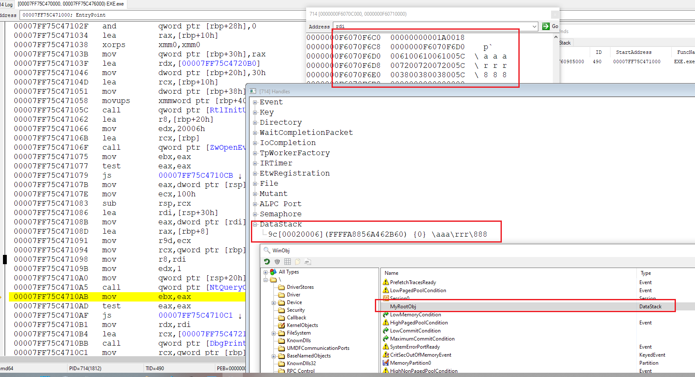

```
DbgKdCreateFileApi:\??\C:\x64\Release\NOT.dll
Load: base=FFFFF8046AEB0000, size=00007000, ep=0000000000000000 NOT.dll
ObCreateObjectType=0, FFFF9185047E2560

ObCreateObject=0 FFFFA88569B7B860

MyObject::MyObject<FFFFA88569B7B860>

OpenProcedure(0, 0, FFFF918500ADE080, FFFFA88569B7B860, 0, 0)

ObInsertObject=0 FFFFA88569B7B860 FFFFFFFF800016B4

OkayToCloseProcedure(FFFF918500ADE080, FFFFA88569B7B860, 00000000000016B4, 0)

CloseProcedure(FFFF918500ADE080, FFFFA88569B7B860, 0000000000000000, 0000000000000001)

DbgKdCreateFileApi:\??\C:\Dbg\tkn.dll
Load: base=FFFFF8046AEC0000, size=00007000, ep=0000000000000000 tkn.dll
ParseProcedure(po=FFFFA88569B7B860 t=FFFF918500AEF640 FFFF91850440DA20 1 40 "\KernelObjects\MyRootObj\aaa\rrr\888" "\aaa\rrr\888" 0000000000000000 0000000000000000)

ObCreateObject=0, FFFFA8856A462B60

MyObject::MyObject<FFFFA8856A462B60>

OpenProcedure(0, 1, FFFF918504D76080, FFFFA8856A462B60, 20006, 0)

QueryNameProcedure(FFFFA8856A462B60 0 0000000F6070F6C0 100 1)

QueryNameProcedure(FFFFA8856A462B60 0 FFFFCE78370008B8 7ff738 0)

OkayToCloseProcedure(FFFF918504D76080, FFFFA8856A462B60, 000000000000009C, 1)

CloseProcedure(FFFF918504D76080, FFFFA8856A462B60, 0000000000000000, 0000000000000001)

DeleteProcedure(FFFFA8856A462B60)

MyObject::~MyObject<FFFFA8856A462B60>

DeleteProcedure(FFFFA88569B7B860)

MyObject::~MyObject<FFFFA88569B7B860>

DriverUnload(FFFF9185054C5E30)
Unload: base=FFFFF8046AEB0000 NOT.dll
Unload: base=FFFFF8046A8D0000 \Windows\System32\drivers\umpass.sys
Unload: base=FFFFF8046A440000 \Windows\System32\Drivers\dump_dumpfve.sys
Unload: base=FFFFF8046A400000 \Windows\System32\drivers\dump_lsi_sas.sys
Unload: base=FFFFF8046A3D0000 \Windows\System32\Drivers\dump_diskdump.sys
System Shutdown
remote disconnected
----- Detach -----
```

